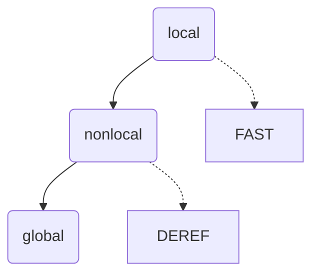

动态生成函数
================================================================================

__测试版本__：Python3.10.8

--------------------------------------------------------------------------------

### Python中动态生成函数可以使用 `lambda` 关键字。

```python
def func_gen(hint):
    assert hint in ("-" , "+")
    if hint == "-":
        return lambda a, b: a - b
    else:
        return lambda a, b: a + b

sub = func_gen("-")
add = func_gen("+")
sub(1, 2) # -1
add(1, 2) # 3
```

### 在循环中动态生成函数的常见错误

```python
# 错误代码

def func_gen(n):
    res = []
    for i in range(n):
        res.append(lambda: i * i)
    return res

funcs = func_gen(3)
for f in funcs:
    print(f(), end=" ")
# 4 4 4
```

并没有按预期打印出 `0 1 4` ，是因为 `func_gen` 中的 `lambda` 绑定的是循环中的迭代变量 `i` ，函数执行完成后， `i` 停留在了 `2` 。

Python中的作用域分为三种：`global` 、 `local` 、 `nonlocal`。变量的查询按照 `local` `nonlocal` `global` 的顺序进行。


`global` 是全局变量，解释器关闭后结束生命周期，通过调用内置函数 `globals()` 能查看到全局变量的字典视图。

`local` 是函数的形参和局部变量，离开函数后就结束生命周期，通过调用内置函数 `locals()` 能查看到当前栈帧内局部变量的字典视图。

`nonlocal` 是闭包引用的变量的作用域，在闭包函数内也属于 `locals()` ，其保存在闭包的函数对象身上。

```python
import dis

def func_gen(n):
    def _(x):
        print(locals())
        return n + x
    return _

f = func_gen("func_gen")
print(f.__closure__)

# (<cell at 0x00000260154A07C0: str object at 0x0000026015491530>,)
```

Python在执行函数的过程中，为了加速局部变量的访问，会在栈帧中将局部变量、函数的参数放入叫 __fast__ 的块中，按索引快速访问，对应 __local__ 类型变量；将闭包将会引用到的变量放入 __deref__ 的块中，对应 __nonlocal__ 类型变量。



所以我们通过dis模块将字节码解析出来，能看到 `LOAD_FAST` 在加载函数形参，看到 `LOAD_DEREF` 在加载闭包引用的外部变量。

```python
import dis

def func_gen(n):
    def _(x):
        return n + x
    return _

f = func_gen(6)
dis.dis(f)

#  5           0 LOAD_DEREF               0 (n)
#              2 LOAD_FAST                0 (x)
#              4 BINARY_ADD
#              6 RETURN_VALUE
```

回到刚才的错误中，函数内动态生成的函数绑定的 `i` 属于闭包引用的外部变量，被放在了 `nonlocal` 作用域中，所以 `func_gen` 执行完毕后 `i` 并没有结束生命周期。

为了让函数的返回值分别是 `0 1 4` ，我们需要另一条规则：函数的默认参数是在函数定义时赋值的。

```python
# 正确代码

def func_gen(n):
    res = []
    for i in range(n):
        res.append(lambda v=i: v * v)
    return res

funcs = func_gen(3)
for f in funcs:
    print(f(), end=" ")
# 0 1 4
```
